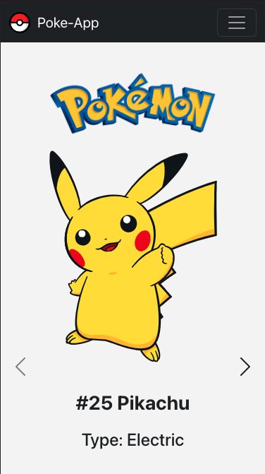
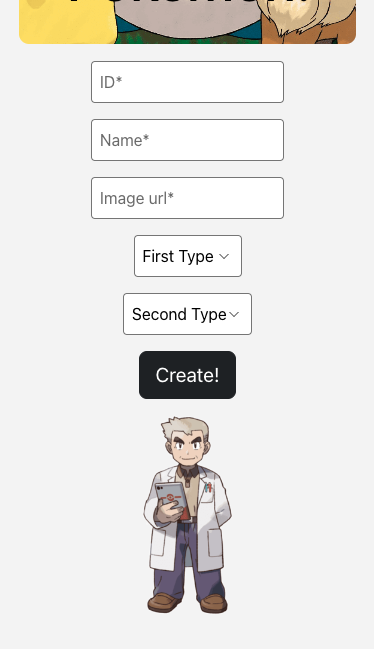
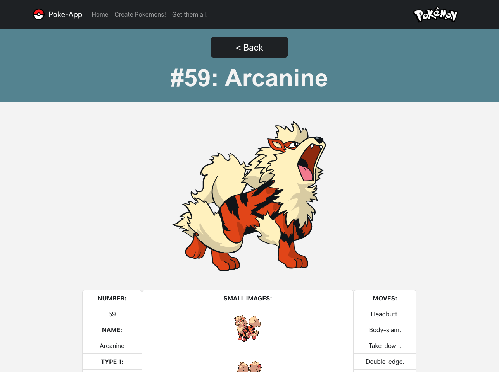

# REACT POKE APP

Do you like Pokemons?? Prepared yourself to get them all!! 

This is a React application built with function components. It incorporates features such as context communication, props, useEffect, debounce, validation, routing and passing information through link params.

 

## Technologies Used

- ReactJS
- React Router
- SCSS
- Axios
- Bootstrap

 

## Want to go directly to the app?

You can try out a demo of this project. Check it at [here!](https://jazzy-hamster-470b4f.netlify.app/).

 

## Want to run it locally? Installation:

To install this project, you´ll just need to follow three steps:

 
- Clone the repository to your local machine
- Run `npm install` to install the required dependencies
- Run `npm start` to start the development server

 

## Features:

This React application has the following main features:

- `Communication through context`: React context is used to manage the state of the application and handle communication between components. You´ll have your own list of Pokemons provide by context.

- `Props communication`: Components communicate with each other through props passed down from a parent component.

- `Component lifecycle methods (useEffect)`: React's component lifecycle methods are used to manage the state of the application and handle events. The useEffect hook allows to manage side effects and update the state of the application when it´s needed.

- `Api request`: Using axios and the [PokeApi](https://pokeapi.co/).

- `Routing and passing information through links`: React Router is used to handle navigation between pages and passing information through link params when a more detailed view of a pokemon is rendered.

- `SCSS styles`: Styling is done using SCSS modules and some Bootstrap elements. Variables, mixins and all the power of sass structure is used on this mobile first app.

- `Modular structure and function components`: The application is built using function components, making it lightweight and easy to maintain. Components are organized into a modular and reusable structure, making it easy to maintain and extend the application.

With these features, this application provides users with a seamless and efficient experience, while enjoying their love for Pokemons.

 

## Usage:

- `Home page`: The first time you go in home will show a message and two buttons. The first button leads to the Pokemon creation page where users can create new Pokemons. The second button leads to a search page where users can search for existing Pokemons.

    If the user creates or captures a new Pokemon, the home page will render a carousel that displays all the captured or created Pokemons. This carousel allows users to easily navigate between their captured or created Pokemons, having access to details and also having the option to remove them.

- `Search page`: Allows users to search for existing Pokemons by name. Once the user enters a Pokemon name in the search bar, the application makes an API call to retrieve the corresponding Pokemon data. Each Pokemon is rendered as a card on the page, displaying its image, name, and type. Additionally, each card features two buttons: one to view more details of the Pokemon and other is a Pokeball icon that, when clicked, captures and saves the Pokemon to the user's personal list.

- `Create page`: Professor Oak is waiting for users to guide through the creatioon process. The user can fill out a form with various details such as name, type and url image.

    The application uses data validation to ensure that the user enters valid information and avoids any conflicts with existing Pokemons from the API. Additionally, the page includes various effects such as animations effects to enhance the user experience. Professor Oak provides alert messages. Once the user submits the form, the new Pokemon is created and added to the user's personal collection, which can be accessed from the home page.

- `More details page`: The detailed information page of this application provides users with access to a specific view of each Pokemon, displaying detailed information such as their abilities and moves. Users can access this page by clicking on the "More details" button on each Pokemon.

    The application passes the Pokemon's ID as a parameter in the URL and uses queries to retrieve the necessary data from the API. The app is also adapted to display information about Pokemons created by the user, even though they may have less information available.

     

 

The Poke App also includes some featuress like a fully responsive nav, some effects and also music (go to the footer and play the Pokeflute).

To use the application, follow these steps:

- On the home page, go to "Search".
- Write some pokemons name till you find some. Click on the pokeball to save them.
- Go back to home to see them.
- Check more clicking on the "More details" button.
- Get back and try to Create a new Pokemon. 
- Take a cofee and go to the footer to enjoy lofi music.

Contributions are always welcome! If you have any ideas, suggestions, or find any issues, please don't hesitate to open an issue or submit a pull request. Your feedback and contributions will help make this project better and more useful for everyone. Thank you for using and supporting this project!

 

## Author:

 

[Fran V. Hernández](https://github.com/Francsy/)

